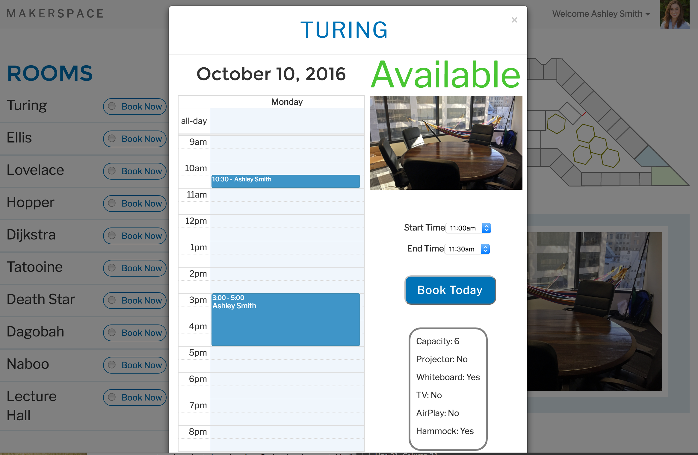
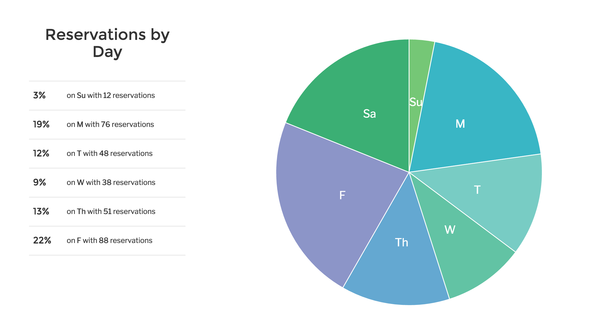

# MakerSpace

MakerSpace is a conference room management solution which leverages socket.io to make reserving and displaying reservations simple for users. MakerSpace provides ths ability to reserve rooms for a specific time and date, a tablet display to place outside of each room that shows the schedule for the given day, and a user friendly calendar to view all schedules in one spot.

## Tech Stack

- React
- Node
- Express
- Promised Mongo

## Features

* Calendar of all current reservations by week

* Dashboard with map, list of rooms and current availabilities

 

* Modal with daily calendar and ability to make reservation by room

* Tablet display for all rooms showing current availability

* D3 display of room and user analytics

* Authentication through MakerPass for use by MakerSquare student and staff

* Deployed on Heroku at maker-space.herokuapp.com (note must have makersquare email to log in)

## Contribution Guidelines

- Create a new issue describing your update
- Fork the repo and create a branch named issue#___, where ___ is the issue number
- Put in a pull request to master in this repo.

## Authors

- Ashley Smith
- Burton Cooke
- Caleb Anderson
- Carlo DiLorenzo
- Jennifer Hakala
